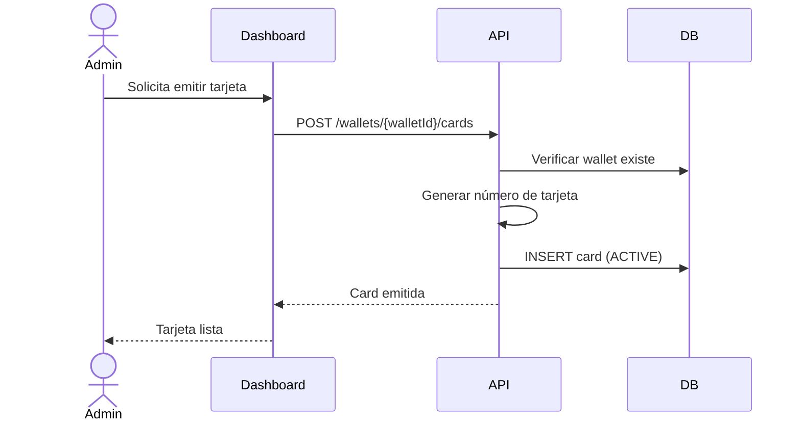

# Flujo de Emisión de Tarjeta

## Pasos
1. Admin selecciona una wallet activa
2. Ingresa nombre del titular y límite (opcional)
3. API genera número de tarjeta virtual (formato: `4xxx-xxxx-xxxx-xxxx`)
4. Tarjeta se crea en estado `ACTIVE`
5. La tarjeta ya puede usarse para pagos
