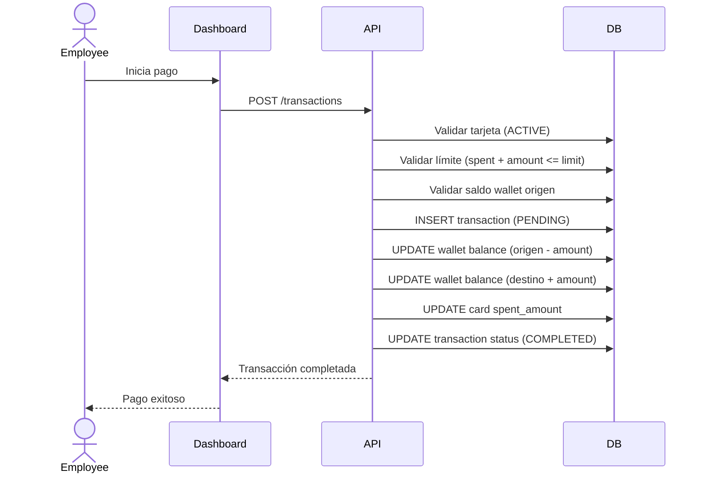

# Flujo de Transacción (Pago)

## Reglas de Negocio
- Una tarjeta no puede gastar más de su `limit_amount`
- Una wallet no puede tener saldo negativo
- El estado inicial de una transacción es `PENDING`
- Si todo valida, pasa a `COMPLETED`; si no, `FAILED`
